For the given code below you have to draw the diagram of how these things are working. Make it similar to the how it was done in previous (Visualise Array Methods) exercise.

- Keep the images in the `img` folder
- using the `` add images below each code snippet

Q.1
```js
let numbers = [100, 200, 33, 45, 65, 76, 51];
function double(num) {
  alert(num);
}
let doubleNum = numbers.forEach(double);
```
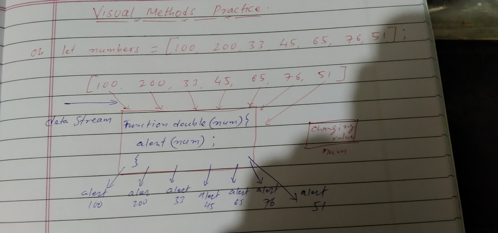

Q.2
```js
let numbers = [100, 200, 33, 45, 65, 76, 51];
function double(num) {
  return num * 2;
}
let doubleNum = numbers.forEach(double);  
```
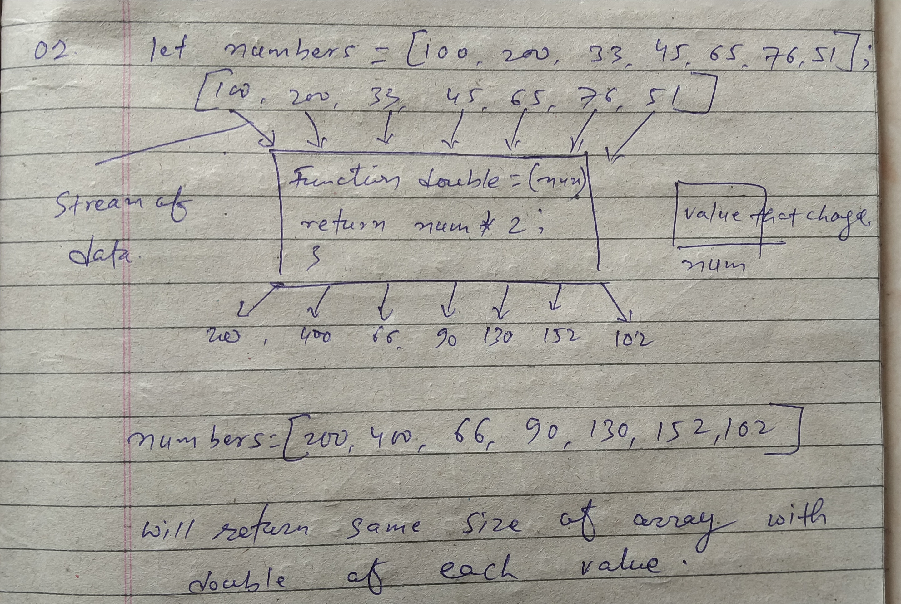


Q.3
```js
let numbers = [100, 200, 33, 45, 65, 76, 51];
function double(num) {
  console.log(num);
}
let doubleNum = numbers.forEach(double);
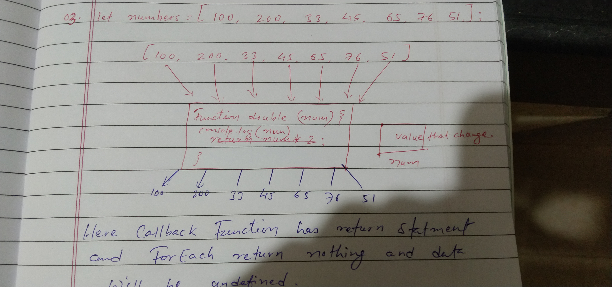```


Q.4
```js
let numbers = [100, 200, 33, 45, 65, 76, 51];
function double(num) {
  return num * 2;
}
let doubleNumbers = numbers.map(double);
```
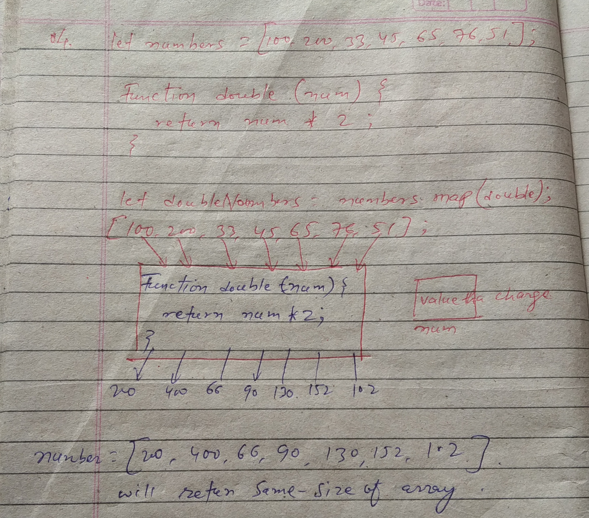


Q.5
```js
let numbers = [100, 200, 33, 45, 65, 76, 51];
function addTwo(num) {
  return num + 2;
}
let doubleNumbers = numbers.map(addTwo);
```
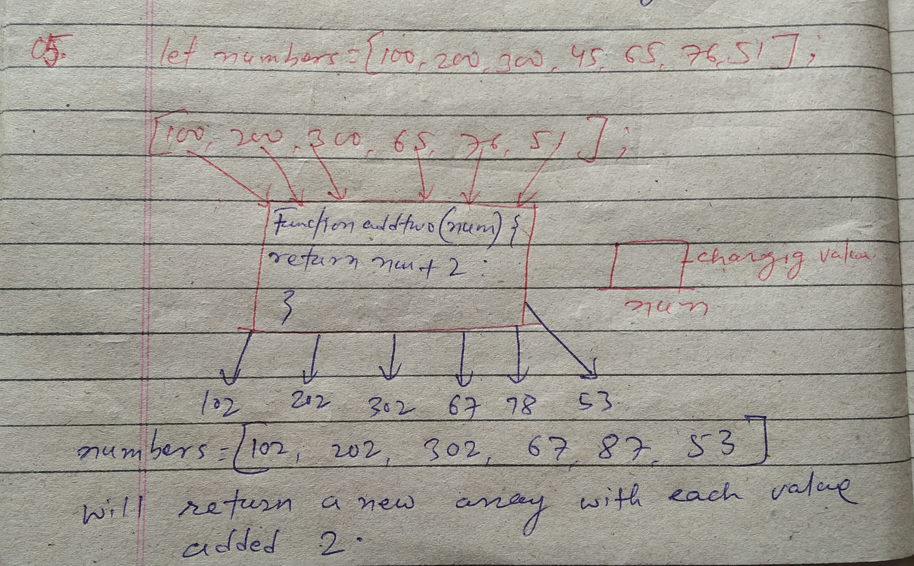


Q.6
```js
let numbers = [100, 200, 33, 45, 65, 76, 51];
function addTwo(num) {
  console.log(num);
}
let doubleNumbers = numbers.map(addTwo);
```
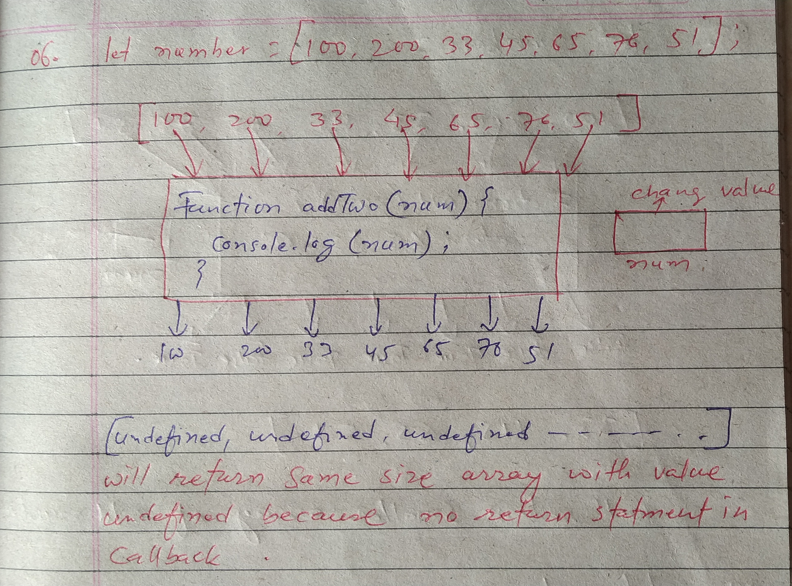


Q.7
```js
let numbers = [100, 200, 33, 45, 65, 76, 51];
function addTwo(num) {
  alert(num);
}
let doubleNumbers = numbers.map(addTwo);
```
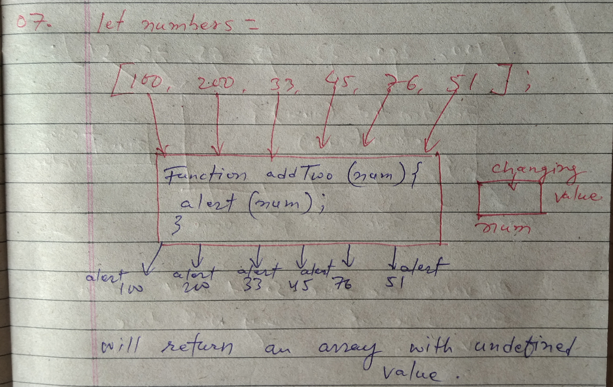


Q.8
```js
let numbers = [100, 200, 33, 45, 65, 76, 51];
function isOdd(num) {
  return num % 2 !== 0;
}
let oddNumbers = numbers.filter(isOdd);
```
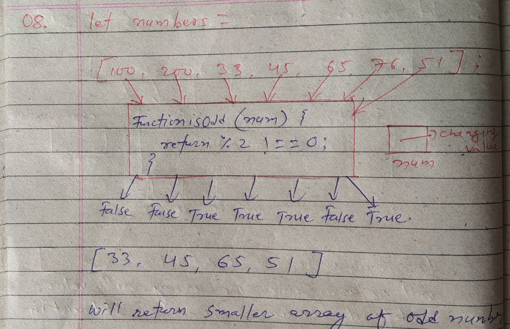


Q.9
```js
let numbers = [100, 200, 33, 45, 65, 76, 51];
function test(num) {
  return num;
}
let filteredNumbers = numbers.filter(test);
```
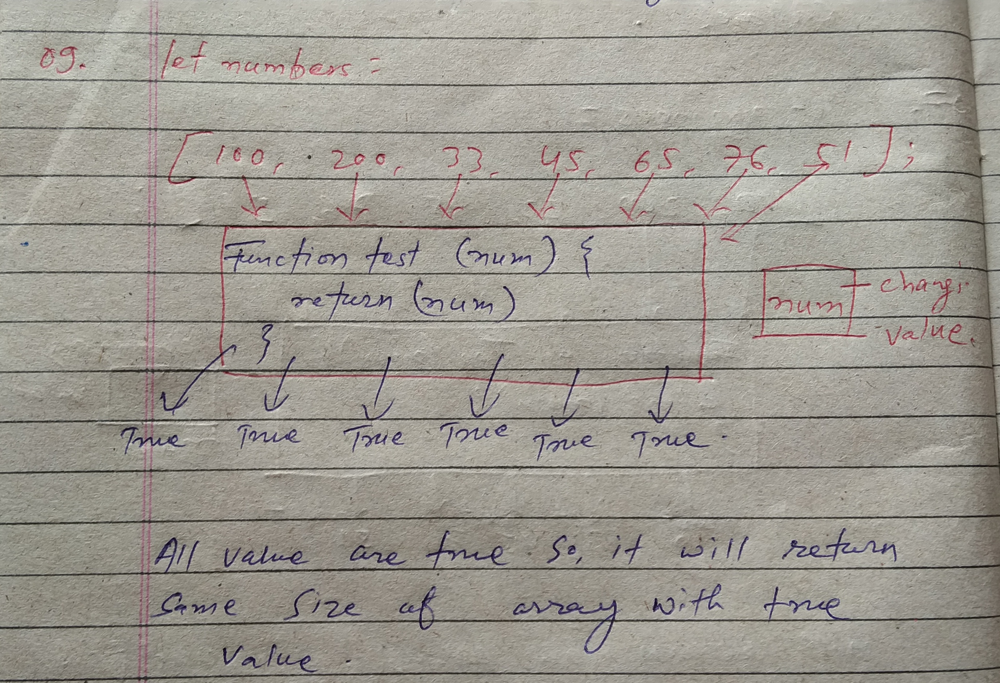


Q.10
```js
let numbers = [100, 200, 33, 45, 65, 76, 51];
function test(num) {
  console.log(num);
}
let filteredNumbers = numbers.filter(test);
```
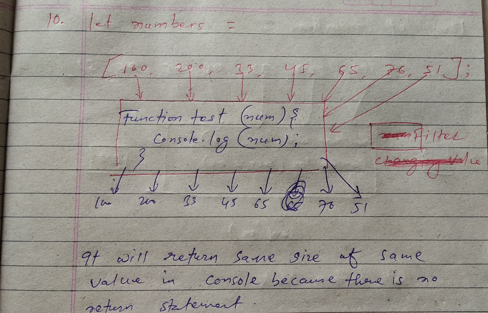


Q.11
```js
let numbers = [100, 200, 33, 45, 65, 76, 51];
function add(accumulator, currentValue) {
  return accumulator + currentValue;
}
let sum = numbers.reduce(add);
```
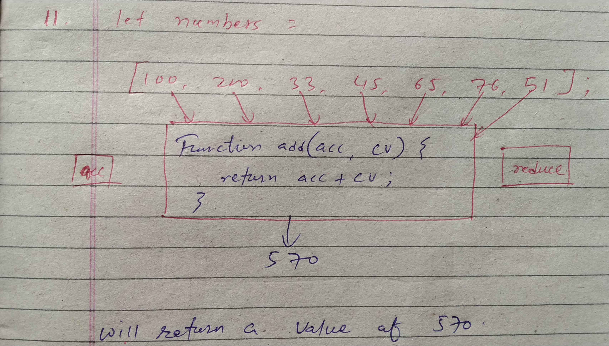


Q.12
```js
let numbers = [100, 200, 33, 45, 65, 76, 51];
function add(accumulator, currentValue) {
  console.log(accumulator + currentValue);
}
let sum = numbers.reduce(add);
```
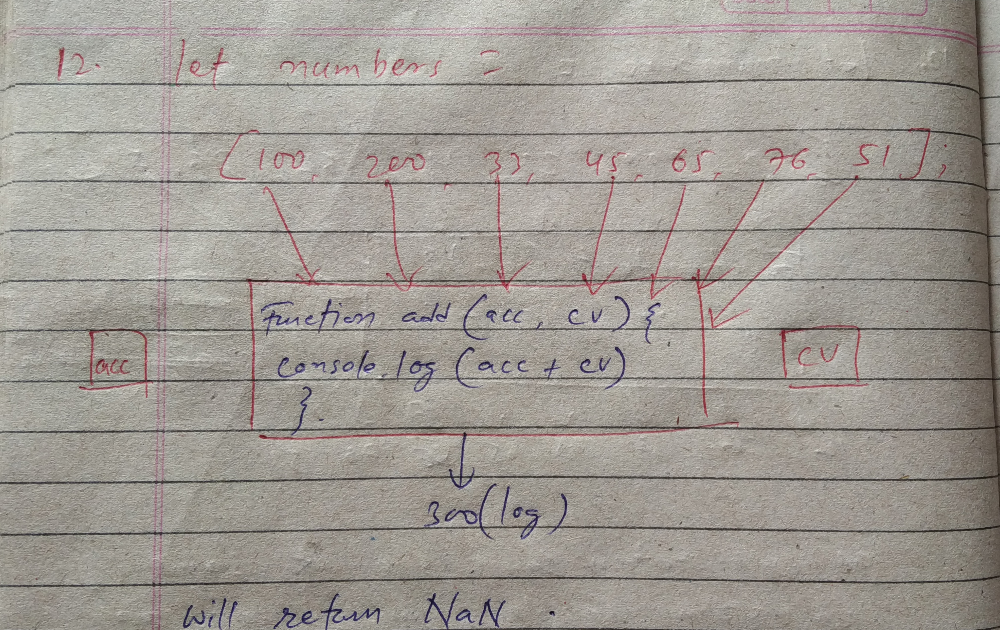

